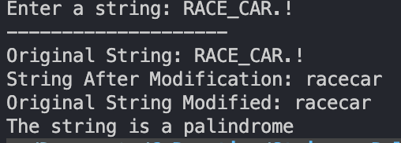

# String Palindrome

    Write a program that checks if a given string is a palindrome. A palindrome is a string that reads the same forwards and backwards (ignoring spaces, punctuation, and case).

    Example:
    Input: "A man, a plan, a canal, Panama"
    Output: The string is a palindrome.

    Without using string.h library functions and other libraries.

### Links
