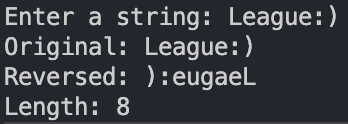

# String Manipulation
    Write a program that takes a string as input and prints the following:

    1. The original string.
    2. The string in reverse.
    3. The length of the string.

    Example:
    Input: "Hello, World!"
    Output:
    Original: Hello, World! ✅
    Reversed: !dlroW ,olleH ✅
    Length: 13 ✅
    
    Without using string.h library functions. 

### Links
Reverse String - https://www.tutorialspoint.com/write-a-c-program-to-reverse-a-string-without-using-a-library-function